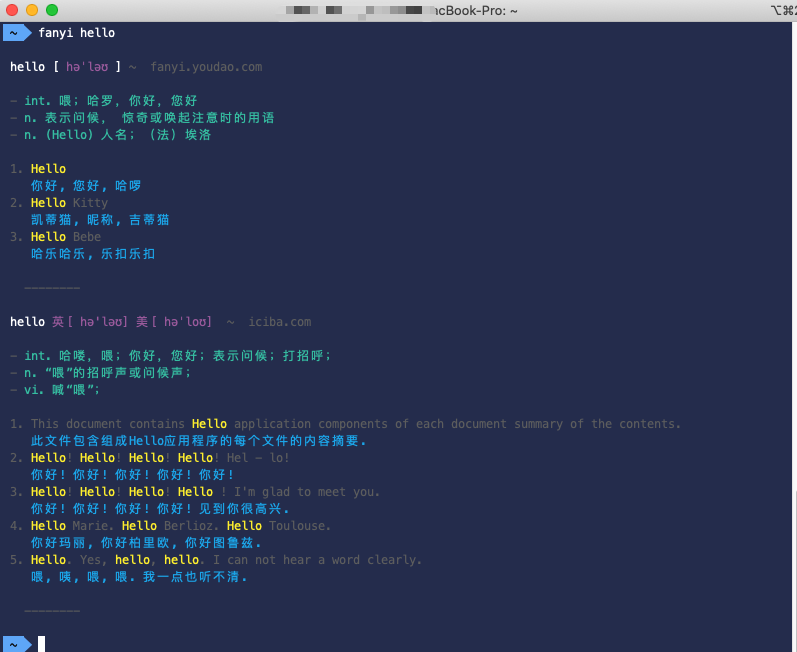

# fanyi
A translate tool in your command line

## Install
For macOs

```bash
$ brew install sakz/tap/fanyi
```
For Linux

```bash
$ source <(curl -sL https://git.io/fanyi-install)
```

## Usage

```bash
$ fanyi word
```

```
Usage: fanyi word

Examples:
  $ fanyi word
  $ fanyi world peace
  $ fanyi 中文
```

> translate English word



> translate English phrase


> translate Chinese

